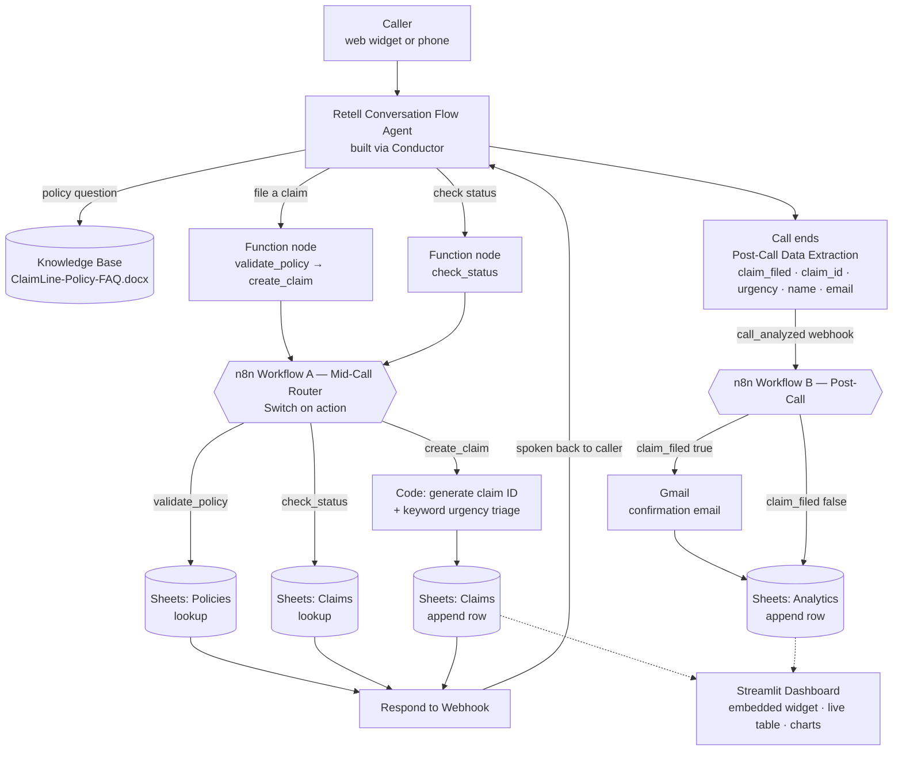

# ClaimLine AI — Voice-Based Insurance Claims Intake & Triage

A voice AI claims assistant for a (fictional) general insurer, built as a hands-on learning project for **Retell AI** (voice agent platform), **n8n** (workflow automation) and **Streamlit** (public dashboard). A caller can ask policy questions answered from an uploaded knowledge base, file a brand new claim — validated against a live policy database, triaged for urgency, and written straight to a Google Sheet — or check the status of an existing claim by ID. All in one natural conversation, with no manual data entry on the business side.

**🔗 Live demo: [claimline-ai.streamlit.app](https://claimline-ai.streamlit.app/)** — the voice agent is embedded on the page; click the call button and talk to it from your browser.

**Backup link:** [talk to the agent directly](https://agent.retellai.com/preview/agent_03adaf0e566cf8b6ac0230bc85) (Retell-hosted, no dashboard) — useful if the Streamlit app has hibernated, since the free tier sleeps after ~7 days idle.

> ⚠️ **Demonstration project — no real data.** ClaimLine Insurance is fictional. Every policy, claim, name and email address is seeded demo data. Do not enter real personal, medical or insurance information into the agent.

## What this project demonstrates

- Building a **Conversation Flow** agent in Retell — a branching node graph rather than a single prompt — scaffolded with Retell's **Conductor** AI copilot, then refined by hand.
- **Mid-call synchronous function calls** to an external system that return data the agent must *react to differently*: valid vs invalid policy, found vs not-found claim, urgent vs standard triage. The conversation genuinely forks on live backend results.
- **Two coordinated n8n workflows split by latency budget** — one synchronous (blocks the live call, must be fast and must always reply) and one asynchronous (fires after the call ends, free to take its time).
- **Conditional routing inside n8n**: a Switch node fanning one webhook into three read/write branches against different Google Sheets tabs.
- **Deterministic urgency triage** as a server-side keyword rule rather than model judgement, because urgency drives a real SLA (24–48 hours vs 5–7 business days) and needs to produce the same answer every time.
- **Post-Call Data Extraction** turning a raw transcript into typed fields, handed to an async workflow via the `call_analyzed` webhook.
- Treating **Google Sheets as a lightweight relational layer** — related `Policies` and `Claims` tables, written by n8n and read by a separate Python app under a deliberately read-only credential.
- Shipping a **public production demo**: a deployed Streamlit dashboard with the real, callable agent embedded, live claim data and charts.
- Working **entirely within free tiers** — no paid API keys anywhere in the stack.

## Architecture



**Why split it this way:** the live call only ever waits on **one** synchronous round-trip (Workflow A) — validate a policy, create a claim, or look up a status. That path is kept deliberately short so the caller isn't left in silence. Everything non-urgent — sending the confirmation email, writing the analytics row — is pushed to Workflow B, which doesn't fire until the call has already ended. This mirrors how production voice-AI systems are actually built: call latency budget is protected aggressively, and anything that can wait, waits.

**Why urgency is computed twice:** the agent forms its own view during the conversation (so it can respond empathetically in the moment), but n8n independently re-runs a keyword rule over the caller's verbatim description and that result is authoritative. The agent's guess can *escalate* a claim to Urgent but can never downgrade one. A record that drives a 24-hour SLA shouldn't depend on a judgement call that might come out differently on the next run.

## Tech stack

| Tool | Role |
|---|---|
| [Retell AI](https://www.retellai.com/) | Voice agent platform — Conversation Flow + Conductor, Knowledge Base, custom functions, Post-Call Data Extraction, webhooks, website widget |
| [n8n](https://n8n.io/) | Two workflows — synchronous mid-call action router, asynchronous post-call confirmation |
| Google Sheets | Data layer — `Policies`, `Claims`, `Analytics` tabs |
| Gmail | Automated claim confirmation emails |
| [Streamlit](https://streamlit.io/) + Community Cloud | Public dashboard and embed host |
| [Plotly](https://plotly.com/python/) | Charts — claim mix, urgency split, volume over time |
| gspread + Google Service Account | Read-only Sheets access from Python |

## Repository contents

```
├── README.md                                  this file
├── streamlit_app.py                           the dashboard + landing page
├── requirements.txt                           Python dependencies
├── .streamlit/
│   ├── config.toml                            pinned light theme
│   └── secrets.toml.example                   secrets shape (no real values)
├── prompts/
│   └── conductor-prompt.txt                   ★ the full Conductor build brief
├── n8n/
│   ├── workflow-a-mid-call-action-router.json      importable, synchronous
│   └── workflow-b-post-call-confirmation.json      importable, asynchronous
├── data/
│   ├── Policies-Seed-Data.csv                 10 fictional policies
│   ├── Claims-Template.csv                    Claims tab columns
│   └── Analytics-Template.csv                 Analytics tab columns
├── docs/
│   ├── ClaimLine-Policy-FAQ.docx              the Knowledge Base source document
│   ├── ClaimLine-AI-Project-Spec.pdf          original project specification
│   ├── retell-setup-guide.md                  click-by-click Retell walkthrough
│   ├── n8n-setup-guide.md                     workflow import, publish, curl tests
│   ├── google-sheets-setup.md                 sheet + service account setup
│   └── streamlit-deployment.md                Community Cloud deployment
└── screenshots/                               (add your own)
```

## Setup guide

Build in this order — each step produces something the next one needs.

### 1. Google Sheets → [`docs/google-sheets-setup.md`](docs/google-sheets-setup.md)
Create the `ClaimLine-Data` spreadsheet with `Policies`, `Claims` and `Analytics` tabs, import the three CSVs from `data/`, and create a **read-only** service account for the dashboard. Produces: a **Spreadsheet ID**.

### 2. n8n → [`docs/n8n-setup-guide.md`](docs/n8n-setup-guide.md)
Import both JSON files, set the Sheet ID in each workflow's `Config` node, attach Google Sheets + Gmail credentials, and **Publish**. Test all three branches with `curl` before Retell exists. Produces: **two production webhook URLs**.

### 3. Retell → [`docs/retell-setup-guide.md`](docs/retell-setup-guide.md)
Upload the Knowledge Base, create a Conversation Flow agent, paste [`prompts/conductor-prompt.txt`](prompts/conductor-prompt.txt) into Conductor, wire the three function nodes to Workflow A's URL, configure Post-Call Data Extraction, point the `call_analyzed` webhook at Workflow B, and publish. Produces: the **agent ID**.

### 4. Streamlit → [`docs/streamlit-deployment.md`](docs/streamlit-deployment.md)
Push to a public GitHub repo, deploy on Community Cloud, paste your secrets. Produces: the **public demo URL**.

### 5. Back to Retell for the widget public key
Minting a public key requires a non-empty **Allowed Domains** list, so it can only be done once you know your deployed hostname — hence the loop back. The dashboard is built to deploy and run *without* Retell secrets (it shows a "voice widget not configured" notice in place of the call button), so this ordering costs nothing. See step 11b of the Retell guide.

## How to test the voice agent

Use Retell's Playground (text mode is cheaper and shows every function call with its full request/response payload), then repeat the key ones as real voice calls.

**Knowledge Base check** — no function should fire:
> "What does my home policy cover?"
> "What documents do I need for a health claim?"
> "How long does a claim take to process?"

**File a claim, valid policy:**
> "I need to file a claim. My policy number is POL-10234."
> *(agent confirms "Sara Ahmed, Auto cover")*
> "Someone reversed into my car in a car park yesterday. No one was hurt."
> *(give a name and an email you can check)*

**Expected:** the agent reads a claim ID back **twice**, digit by digit, and mentions a 5–7 business day review.

**File a claim, invalid policy:**
> "My policy is POL-99999."

**Expected:** the agent says it can't find it, reads the digits back, offers one retry, then hands off. It must **never** reach the claim-creation step.

**Urgency triage:**
> "I was rear-ended and my wife was taken to hospital by ambulance."

**Expected:** claim comes back **Urgent**, and the agent explains the 24–48 hour priority review.

**Status check:**
> "Can you check claim CLM-000001?"  → reads back the real status
> "Can you check claim CLM-999999?"  → graceful not-found, one retry, no invented claim

**Then verify all five places agree:**
- **Retell transcript** — the function call and its response payload
- **n8n Executions** — a real execution, all nodes green
- **Google Sheet `Claims` tab** — a new row with the right details and urgency
- **Gmail** — the confirmation email actually arrived
- **Streamlit dashboard** — the claim appears after clicking Refresh

## Screenshots

_Add yours to `screenshots/` and link them here._

## Notes and learnings

- **The Conversation Flow / Single Prompt distinction is about guarantees, not features.** A claim must never be created before the policy is validated. In a Single Prompt agent that's a polite instruction the model can skip when a caller is insistent. In a Conversation Flow it's the graph — `create_claim` is only reachable through the `valid == true` edge.
- **`Always Output Data` is the difference between "not found" and dead air.** An n8n Google Sheets lookup that matches nothing returns *zero items*, so the branch stops, no Respond node fires, and the caller hears silence until the function times out. Every lookup node in a synchronous workflow needs it on.
- **Retell's `call_ended` webhook fires before post-call analysis has run.** Only `call_analyzed` has the extracted fields populated. Wiring the intuitive-looking event gives you a workflow that runs green and emails nobody.
- **Each n8n node replaces `$json` with its own output.** After a Gmail node runs, `$json` is Gmail's API response — not your data. Reach back with `$('Node Name')` instead of assuming the payload survived.
- **Keyword triage beat prompt-based triage on predictability.** Asking the model "is this urgent?" gave different answers to the same description across runs. A keyword rule over the caller's verbatim words is boring, auditable, and always agrees with itself — which is what a field driving an SLA needs.
- **Voice agents need identifiers read twice.** Nobody writes down a six-digit claim ID correctly the first time they hear it over a phone line. Say it, pause, say it again, then ask "did you get that?"
- **Validate the policy before collecting anything else.** Ordering the flow that way costs nothing and saves the caller from answering five questions before being told their policy doesn't exist.

## Author

Built by **Muhammad Ali Hashim** as a hands-on Retell AI + n8n + Streamlit learning project, and a deliberate step up from [BrightPath Tutoring](https://github.com/alihashim786/brightpath-tutoring-voice-agent) — Single Prompt → Conversation Flow, one linear workflow → two coordinated workflows with conditional routing, and a deployed public dashboard instead of a README-only demo.

[GitHub](https://github.com/alihashim786) · [LinkedIn](https://linkedin.com/in/alihashimraza)
